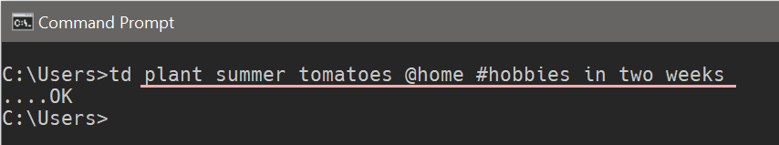
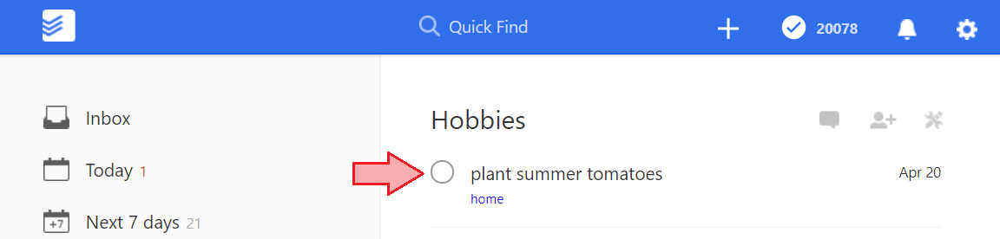

# todoist-add
Quick Add Todoist tasks, from the command line.

## Usage:
```
$ td <task>
```

For example, to add a task `plant summer tomatoes`, tag it with the label
`@home`, assign it to the `#hobbies` project, and set the due date two weeks
from now:

```
$ td plant summer tomatoes @home #hobbies in two weeks
```

> See Todoist's [Task Quick Add syntax](https://support.todoist.com/hc/en-us/articles/115001745265)

#### Visual Example


#### Result


## Installation
Build an executable and place it in your path.

## Building
To build an executable, with `pipenv` and Python 3.x, run:

```
pipenv install --dev
pipenv run pyinstaller --onefile td.py
```

## Why?

> Probably just use this instead: [sachaos/todoist](https://github.com/sachaos/todoist)

However, if you insist, here are two justifications:

- It does just one thing (is this called "distraction-free"?)
- Invoking is quick and memorable
